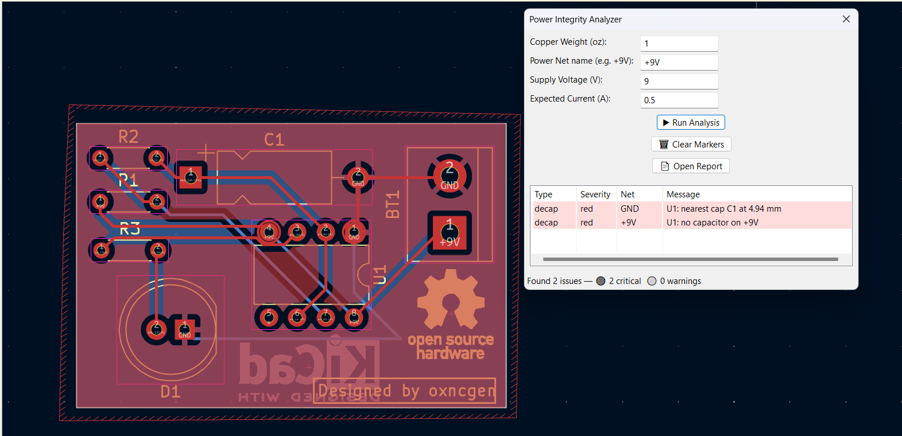
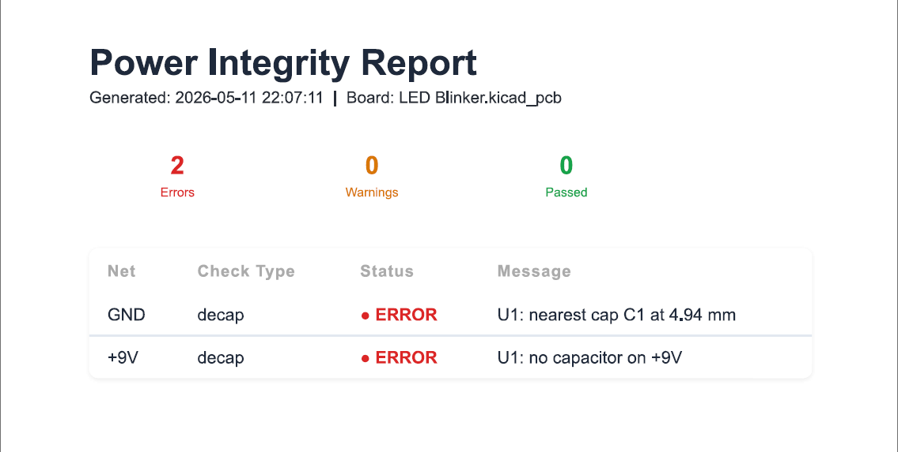

# Power Integrity Analyzer — KiCad Plugin

> A KiCad 9 Action Plugin that performs automated **Power Integrity (PI)** checks on PCB power nets using IPC-2221 based calculations.

Developed by Dipanshu Katole as part of the **FOSSEE KiCad Plugin Initiative**.

---

# Table of Contents

- [Overview](#overview)
- [Features](#features)
- [Checks Performed](#checks-performed)
- [Screenshots](#screenshots)
- [Requirements](#requirements)
- [Installation](#installation)
  - [Windows](#windows)
  - [Linux](#linux)
- [Usage](#usage)
- [Formula Reference](#formula-reference)
- [Project Structure](#project-structure)
- [Configurable Parameters](#configurable-parameters)
- [Report Output](#report-output)
- [Known Limitations](#known-limitations)
- [Contributing](#contributing)
- [Acknowledgements](#acknowledgements)

---

# Overview

**Power Integrity Analyzer** is a KiCad 9 PCB Action Plugin that analyzes power delivery paths directly inside the PCB Editor.

The plugin evaluates:

- PCB trace current carrying capability
- Voltage drop across power traces
- Decoupling capacitor placement quality

using industry-standard IPC-2221 based calculations.

Violations are highlighted directly on the PCB canvas using graphical markers and are also summarized inside a browser-viewable HTML report.

The plugin is intended for:

- PCB designers
- Embedded system developers
- Students learning PCB power design
- Engineers validating low-voltage/high-current layouts

---

# Features

| Feature | Description |
|---|---|
| IPC-2221 trace analysis | Validates trace width against expected current |
| IR drop estimation | Computes voltage drop using copper resistivity |
| Decoupling analysis | Detects missing or distant decoupling capacitors |
| Board markers | Violations shown directly on PCB canvas |
| HTML report | Auto-generated color-coded report |
| Cross-platform | Supports Windows and Linux |
| Interactive workflow | Runs directly inside KiCad PCB Editor |

---

# Checks Performed

| Check | Formula | Flag Condition |
|---|---|---|
| **Trace width vs current** | IPC-2221: `I = k × ΔT^0.44 × A^0.725` | Trace too thin for expected current |
| **Voltage drop (IR drop)** | `V = I × ρL/A` | Drop > 3% (warning), > 5% (error) |
| **Decoupling capacitor placement** | Euclidean pad-to-cap distance | No capacitor found or nearest cap > 3 mm |

---

# Screenshots

## Plugin Dialog + Board Markers

<!-- > *(html_report_demo.png)* -->


- User selects:
  - power net
  - supply voltage
  - expected current
  - copper weight

Violations are marked directly on the PCB using red circles on the `User.1` layer.

---

## HTML Report

<!-- > *(screenshot)* -->


The generated report contains:

- Summary statistics
- Severity-based warnings/errors
- Detailed trace analysis
- Decoupling capacitor analysis
- Exportable HTML format for documentation and review

---

# Requirements

| Dependency | Version |
|---|---|
| KiCad | 9.0 |
| Python | 3.x (bundled with KiCad) |

> KiCad ships with its own Python environment, so no separate Python installation is required.

---

# Installation

## Windows

1. Download or clone the repository:

```bash
git clone <repository-url>
```

2. Copy the `power_integrity/` folder into:

```text
C:\Users\<your_username>\Documents\KiCad\9.0\scripting\plugins\
```

3. Open **KiCad PCB Editor**

4. Go to:

```text
Tools → External Plugins → Refresh Plugins
```

5. The **Power Integrity Analyzer** icon will appear in the toolbar.

---

## Linux

1. Clone the repository:

```bash
git clone <repository-url>
```

2. Copy the plugin folder:

```bash
cp -r power_integrity/ ~/.local/share/kicad/9.0/scripting/plugins/
```

3. Open KiCad PCB Editor

4. Refresh plugins:

```text
Tools → External Plugins → Refresh Plugins
```

5. Launch the plugin from the toolbar.

---

# Usage

> Ensure your PCB is routed and saved before running analysis.

1. Open a `.kicad_pcb` file inside the KiCad PCB Editor.

2. Click the **Power Integrity Analyzer** toolbar button.

3. Fill in the analysis parameters:

| Parameter | Example |
|---|---|
| Power net | `+5V`, `VCC`, `3V3` |
| Supply voltage | `5` |
| Expected current | `2.0 A` |
| Copper weight | `1 oz` |

4. Click:

```text
▶ Run Analysis
```

5. The plugin will:

- Analyze all matching traces
- Estimate IR drop
- Check decoupling capacitor placement
- Highlight violations on the board
- Populate the result table
- Generate an HTML report

6. Click:

```text
📄 Open Report
```

to open the generated report in your browser.

---

# Formula Reference

## IPC-2221 Trace Width Formula

```text
I = k × ΔT^0.44 × A^0.725
```

Where:

| Symbol | Meaning |
|---|---|
| `I` | Current (A) |
| `k` | IPC constant |
| `ΔT` | Allowed temperature rise |
| `A` | Trace cross-sectional area |

For outer layers:

```text
k = 0.048
```

For inner layers:

```text
k = 0.024
```

---

## Cross-Sectional Area

```text
A = width × thickness
```

Conversions:

```text
1 mm = 39.37 mils
1 oz copper = 35 µm = 1.378 mils
```

---

## IR Drop Formula

```text
V_drop = I × R
R = ρ × L / A
```

Where:

| Symbol | Meaning |
|---|---|
| `ρ` | Copper resistivity |
| `L` | Trace length |
| `A` | Cross-sectional area |

Copper resistivity used:

```text
ρ = 1.72 × 10⁻⁸ Ω·m
```

---

# Project Structure

```text
power_integrity/
│
├── __init__.py
├── power_integrity.py     # KiCad ActionPlugin + wxPython dialog
├── checkers.py            # PI rule checks
├── utils.py               # Mathematical helper functions
├── report.py              # HTML report generator
├── icon.png               # Toolbar icon
└── README.md
```

---

# Configurable Parameters

## Runtime Parameters

Configured through the plugin dialog:

- Copper weight
- Supply voltage
- Expected current
- Power net selection

---

## Internal Thresholds

Inside source files:

| Parameter | Default |
|---|---|
| IR drop warning | 3% |
| IR drop error | 5% |
| Max decap distance | 3 mm |

These values can be modified directly inside:

```text
checkers.py
power_integrity.py
```

---

# Report Output

The generated HTML report includes:

- Board information
- Analysis timestamp
- Power net summary
- Trace width violations
- IR drop analysis
- Decoupling capacitor checks
- Severity labels (warning/error)
- Summary statistics

The report opens automatically in the browser after generation.

---

# Known Limitations

- IPC-2221 equations provide estimation, not full electromagnetic simulation.
- Thermal coupling and transient current effects are not modeled.
- Multi-layer return path effects are not analyzed.
- Differential pair and high-speed SI effects are outside plugin scope.
- Plugin currently focuses on DC power integrity checks.

---

# Contributing

Contributions are welcome.

## Steps

1. Fork the repository

2. Create a feature branch:

```bash
git checkout -b feature/my-feature
```

3. Commit changes clearly:

```bash
git commit -m "Added IR drop optimization"
```

4. Push the branch and open a Pull Request.

Please include:

- KiCad version
- Operating system
- Screenshots/logs if reporting bugs

---

# Acknowledgements

- IPC-2221 — Generic Standard on Printed Board Design
- KiCad Python API
- FOSSEE, IIT Bombay
- Open-source PCB and EDA community

---

# References

- IPC-2221 Standard
- KiCad Python API Documentation
- PCB Power Integrity Design Guidelines

---

*Power Integrity Analyzer is developed as part of the open-source KiCad plugin ecosystem under the FOSSEE initiative.*
